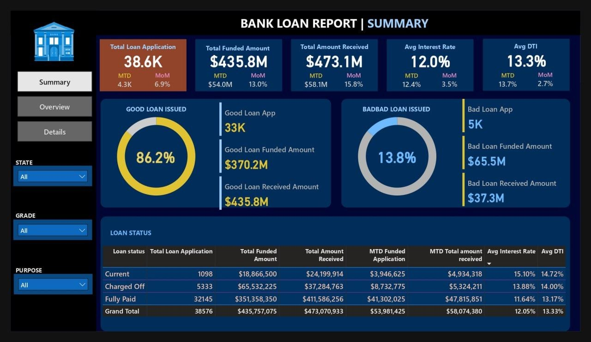
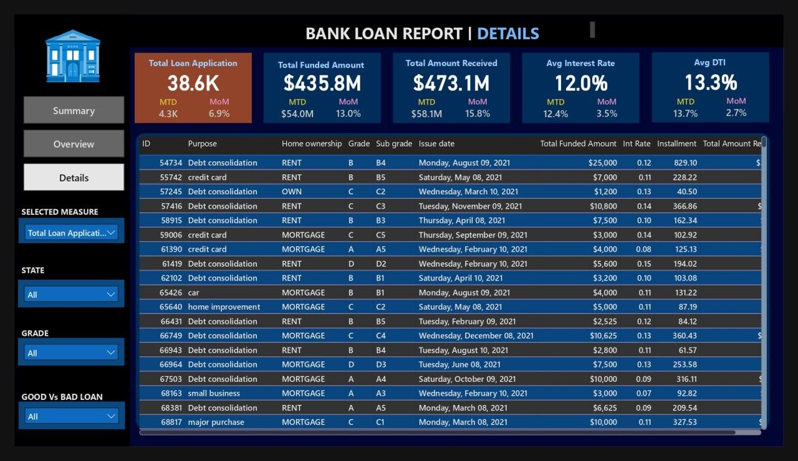
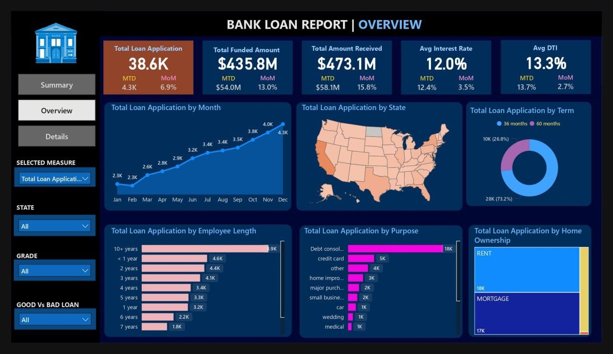

# Bank Loan Portfolio Analytics Dashboard

## Project Overview
Built an end-to-end Power BI dashboard to analyze a lending portfolio of approximately **38.6K loan applications**, tracking funded amounts, repayments, interest performance, debt-to-income ratios, and loan quality.

The dashboard was designed to support both executive-level portfolio monitoring and detailed loan-level analysis through interactive KPI cards, portfolio segmentation, trend reporting, and drill-down views.

## Business Objective
The goal of this project was to help stakeholders quickly understand:

- total loan application volume
- total funded amount
- total amount received
- average interest rate
- average debt-to-income ratio
- good loan vs. bad loan distribution
- borrower and portfolio trends across multiple dimensions

## Tools Used
- Power BI
- DAX
- Data Modeling
- Interactive Reporting
- Dashboard Design

## Key Features
- Executive KPI cards for Total Loan Applications, Total Funded Amount, Total Amount Received, Average Interest Rate, and Average DTI
- Month-to-date and month-over-month tracking for key lending metrics
- Good Loans vs. Bad Loans segmentation
- Loan application trend analysis by month
- Geographic analysis by state
- Loan distribution by term, employment length, purpose, and home ownership
- Loan-level detail table for transaction review
- Interactive slicers for dynamic filtering across the report

## Pages Included

### 1. Summary Page
The summary page provides a high-level lending portfolio view with KPI cards and loan quality segmentation.

### 2. Details Page
The details page allows users to inspect individual loan records, including loan purpose, home ownership, grade, sub-grade, issue date, funded amount, interest rate, installment, and total amount received.

### 3. Overview Page
The overview page highlights borrower and portfolio trends through charts and maps, including applications by month, state, loan term, employment length, purpose, and home ownership.

## Impact
- Enabled clearer visibility into portfolio health and repayment performance
- Improved analysis of borrower behavior and portfolio composition
- Supported faster executive review through interactive KPI reporting
- Created a structured reporting experience that moves from high-level portfolio insights to detailed transactional analysis

## Notes
This repository contains project documentation and screenshots for portfolio presentation purposes.